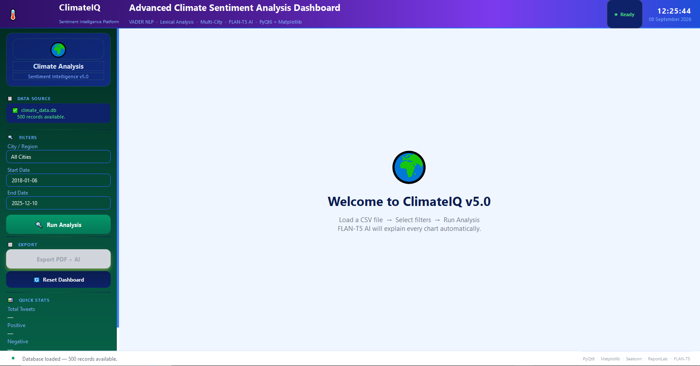
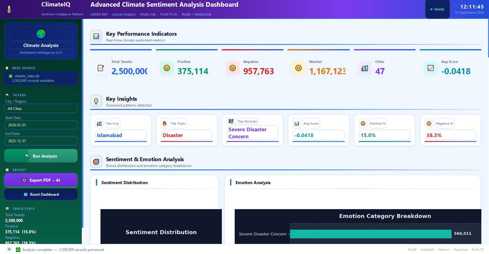
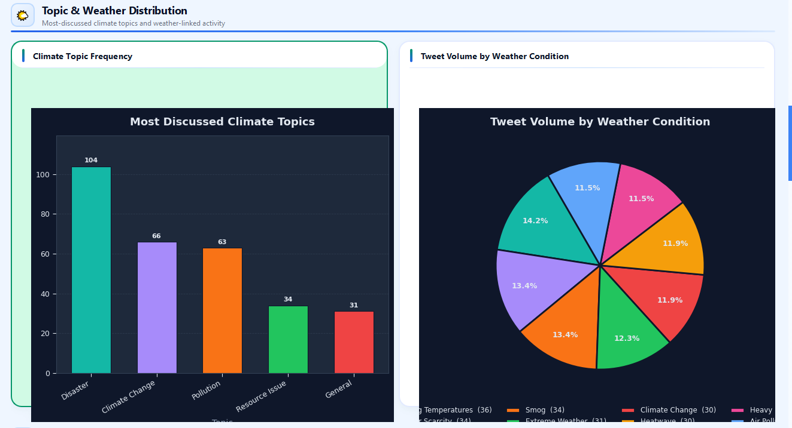
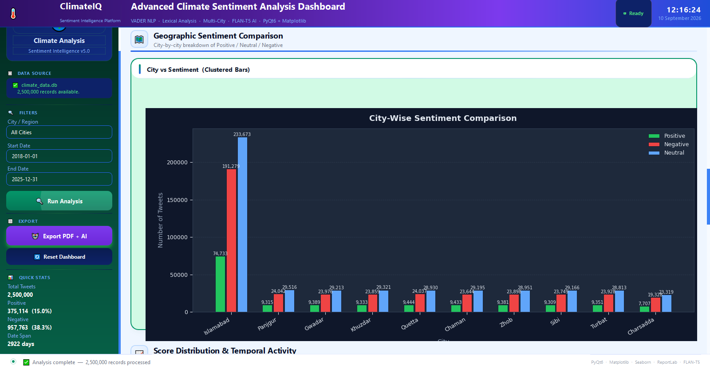
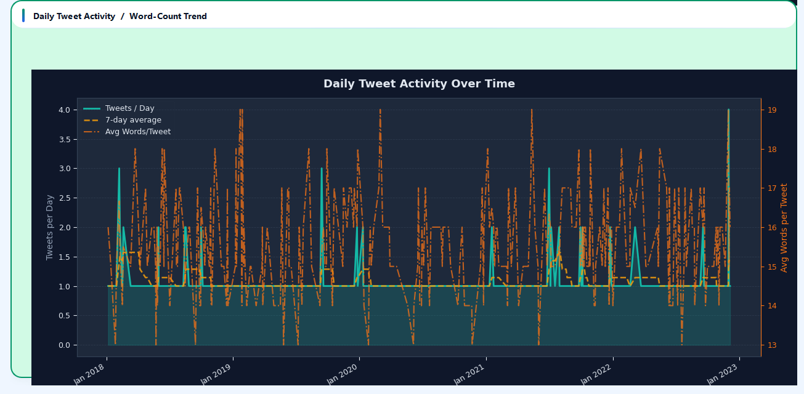
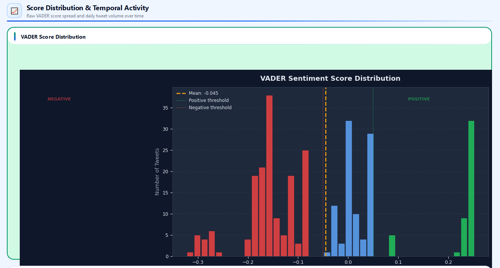
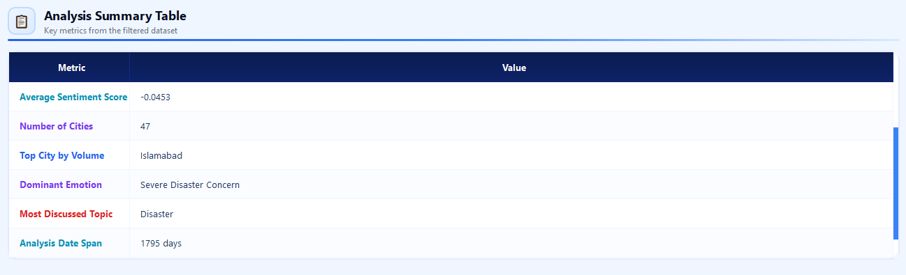

# ClimateIQ v5 — Climate Sentiment Classifier

ClimateIQ v5 is a desktop application built to analyze climate-related social media data and identify the sentiment expressed in individual posts.

The application is designed to work with large tweet datasets and uses a multi-step processing pipeline that includes text cleaning, lexical processing, and VADER-based sentiment analysis. The processed data is stored locally in an SQLite database, making it easy to filter, query, and analyze through the application's graphical interface.

Along with sentiment analysis, ClimateIQ includes data visualization and PDF reporting features so that the results can be explored and presented in a more useful format.

---

## Application Preview

### 1. Plain Dashboard & Welcome Screen


### 2. Header, KPIs & Key Insights


### 3. Sentiment Distribution & Emotion Breakdown


### 4. Topic & Weather Distribution


### 5. Geographic Sentiment Comparison


### 6. Daily Tweet Activity & Word-Count Trend


### 7. VADER Sentiment Score Distribution


### 8. Analysis Summary Table


---

## Features

### Sentiment Analysis

ClimateIQ uses a combination of text-processing and rule-based techniques to analyze climate-related social media content.

* Regex-based text cleaning and normalization
* Lexical text processing
* VADER-based sentiment scoring
* Rule-based sentiment classification
* Processing of climate-related tweets and social media content

### Large Dataset Processing

The application is intended for working with large tweet datasets rather than only individual posts.

* Batch-based dataset processing
* Suitable for high-volume tweet datasets
* Local SQLite storage for processed records
* Persistent access to previously processed data

### Desktop Interface

ClimateIQ provides a PyQt-based desktop interface for working with the processed data.

The interface includes:

* Dataset filtering
* Interactive data tables
* Analytical views
* Sentiment-related statistics
* Integrated charts and visualizations

### Data Visualization

The application includes several visualization features to make the sentiment results easier to understand.

* Sentiment distribution charts
* Statistical visualizations
* Matplotlib integration
* Seaborn integration
* Visualization of processed climate sentiment data

### PDF Reports

ClimateIQ can generate PDF reports from the analysis results.

Reports can include:

* Analysis summaries
* Sentiment statistics
* Generated visualizations
* Other relevant analytical output

PDF generation is handled using ReportLab.

### Local Database

Processed data is stored in a local SQLite database.

This provides:

* Persistent local storage
* Database-based filtering and querying
* Easy access to processed tweet data
* No requirement for a separate database server

---

## Project Structure

The main project files and directories are organized as follows:

```text
ClimateIQ_v5/
│
├── main.py
├── BUILD.bat
├── CREATE_SHORTCUT.bat
├── ClimateIQ.spec
├── climateiq.ico
├── requirements.txt
│
├── core/
│   ├── db_manager.py
│   ├── chart_engine.py
│   ├── pdf_reporter.py
│   └── ai_explainer.py
│
├── ui/
│   ├── main_window.py
│   └── widgets.py
│
├── database/
│   ├── sample_tweets.csv
│   └── climate_data.db
│
├── scripts/
│   └── csv_to_sqlite.py
│
└── docs/
```

### Main Components

| File / Directory           | Purpose                                                                        |
| -------------------------- | ------------------------------------------------------------------------------ |
| `main.py`                  | Starts the ClimateIQ application.                                              |
| `core/db_manager.py`       | Handles SQLite connections, queries, and database operations.                  |
| `core/chart_engine.py`     | Creates charts and other visualizations from the analysis data.                |
| `core/pdf_reporter.py`     | Generates PDF reports containing analysis results and visualizations.          |
| `core/ai_explainer.py`     | Generates summaries and explanations of sentiment analysis results.            |
| `ui/main_window.py`        | Contains the main application window and primary GUI logic.                    |
| `ui/widgets.py`            | Contains custom PyQt widgets used throughout the interface.                    |
| `scripts/csv_to_sqlite.py` | Converts CSV tweet data into an SQLite database.                               |
| `database/`                | Contains the sample dataset and local SQLite database used by the application. |
| `docs/`                    | Contains additional project documentation.                                     |
| `BUILD.bat`                | Windows batch script used to build the standalone application.                 |
| `CREATE_SHORTCUT.bat`      | Creates a desktop shortcut for the application.                                |
| `ClimateIQ.spec`           | PyInstaller configuration used when creating the Windows executable.           |
| `climateiq.ico`            | Application icon.                                                              |
| `requirements.txt`         | Lists the Python packages required by the project.                             |

---

## Technology Stack

ClimateIQ is built using Python and a set of commonly used libraries for data processing, visualization, desktop development, and reporting.

| Component            | Technology / Library      |
| -------------------- | ------------------------- |
| Programming Language | Python 3.x                |
| GUI Framework        | PyQt                      |
| Data Processing      | Pandas, NumPy             |
| Database             | SQLite3                   |
| Sentiment Analysis   | VADER                     |
| Text Processing      | Regex, Lexical Processing |
| Visualization        | Matplotlib, Seaborn       |
| PDF Reporting        | ReportLab                 |
| Executable Build     | PyInstaller               |

---

## How the Analysis Works

ClimateIQ processes the input dataset through a series of steps. Each tweet is cleaned and prepared before sentiment analysis is performed.

The general workflow is:

```text
Raw Tweet Data
      │
      ▼
Text Cleaning
      │
      ▼
Lexical Processing
      │
      ▼
Rule-Based Sentiment Analysis
      │
      ▼
Sentiment Classification
      │
      ▼
SQLite Database
(database/climate_data.db)
      │
      ├──────────────► Charts & Visualizations
      │
      ├──────────────► Interactive GUI
      │
      └──────────────► PDF Reports
```

The processed results are stored in the local SQLite database. From there, the application can use the data for filtering, analysis, visualization, and report generation.

---

## Requirements

Before running ClimateIQ from source, make sure the following are available:

* Python 3.x
* Windows OS if you plan to use the provided `.bat` scripts or the standalone Windows build
* All Python packages listed in `requirements.txt`

---

## Installation

Clone the repository:

```bash
git clone https://github.com/AlishbaNafees/ClimateIQ_v5.git
```

Move into the project directory:

```bash
cd ClimateIQ_v5
```

Install the required Python packages:

```bash
pip install -r requirements.txt
```

Once the dependencies have been installed, the application can be run directly from the source code.

---

## Database Setup

ClimateIQ uses a local SQLite database located at:

```text
database/climate_data.db
```

If you are starting with the provided CSV dataset, you can create the SQLite database using the conversion script.

### Generate the Database from CSV

Run:

```bash
python scripts/csv_to_sqlite.py database/sample_tweets.csv
```

This converts the sample CSV data into the SQLite format used by the application.

---

## Standalone Build Configuration

The standalone Windows version of ClimateIQ expects the database to be available in a specific location relative to the application.

For a packaged build, the database should be located at:

```text
dist\ClimateIQ\database\climate_data.db
```

A typical standalone directory should therefore look similar to:

```text
dist/
└── ClimateIQ/
    ├── ClimateIQ.exe
    └── database/
        └── climate_data.db
```

Keeping the database in this location allows the application to discover and use the local data when running outside the Python source environment.

---

## Running ClimateIQ

### Run from Source

From the project directory, run:

```bash
python main.py
```

The ClimateIQ desktop application should then open normally.

### Run the Standalone Version

If you have already built the Windows version, launch:

```text
ClimateIQ.exe
```

from the extracted standalone package or from:

```text
dist\ClimateIQ\
```

---

## Building the Windows Executable

ClimateIQ can be packaged as a standalone Windows application using PyInstaller.

The easiest option is to run the included build script:

```text
BUILD.bat
```

You can also run PyInstaller manually:

```bash
python -m PyInstaller ClimateIQ.spec --noconfirm
```

After the build completes, the generated application will be available in the PyInstaller output directory.

Make sure the required database file is placed under:

```text
dist\ClimateIQ\database\climate_data.db
```

before distributing or running the packaged application.

---

## Data and Reports

The application is designed around a local workflow. Tweet data is processed, classified, and stored in SQLite, after which the stored results can be used by the application's analytical tools.

From the processed dataset, ClimateIQ can provide:

* Sentiment distributions
* Statistical analysis
* Interactive data views
* Charts and visualizations
* PDF-based analytical reports

This makes it possible to move from raw climate-related social media data to a set of organized and reviewable analytical results within the same application.

---

## License

ClimateIQ v5 is distributed under the **MIT License**.

---

## Repository

The source code for ClimateIQ v5 is available on GitHub:

[ClimateIQ v5 GitHub Repository](https://github.com/AlishbaNafees/ClimateIQ_v5?utm_source=chatgpt.com)

---
